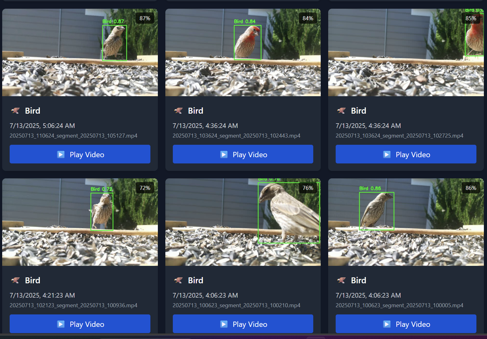
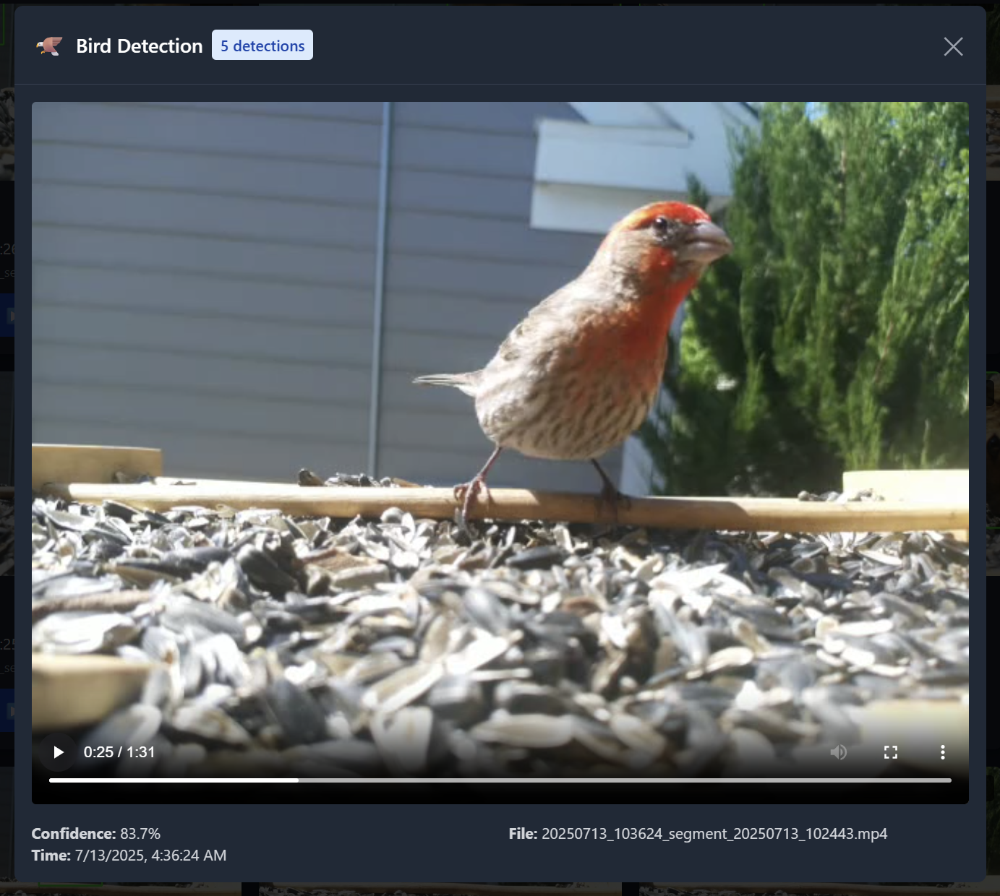

# BirdCam - Distributed Wildlife Detection System

A two-system architecture for wildlife detection: Raspberry Pi cameras capture video, and a separate AI server processes it.




## 🏗️ System Architecture

BirdCam uses a **two-system design** for flexibility and performance:

```
┌─────────────────────┐                    ┌─────────────────────┐
│   RASPBERRY PI      │                    │   AI PROCESSING     │
│                     │                    │      SERVER         │
│  • Camera capture   │     Network        │  • YOLO detection   │
│  • Motion detection │ ◄────────────────► │  • Video storage    │
│  • Video streaming  │    Sync videos     │  • Web interface    │
│  • Basic web API    │                    │  • User management  │
└─────────────────────┘                    └─────────────────────┘
         ▲                                           ▲
         │                                           │
         └─────────────────┬─────────────────────────┘
                           │
                    ┌──────▼──────┐
                    │ WEB BROWSER │
                    │             │
                    │ • Live view │
                    │ • Settings  │
                    └─────────────┘
```

### System 1: Raspberry Pi (Camera Capture)
- **Purpose**: Capture video from cameras
- **Runs**: `pi_capture/main.py`
- **Features**: Motion detection, multi-camera support, video buffering
- **Config**: Uses `.env.pi` (renamed from `.env`)

### System 2: AI Processing Server (Any Linux/Windows/Mac)
- **Purpose**: Process videos with AI, serve web interface
- **Runs**: `ai_processor/main.py`
- **Features**: YOLO detection, video storage, web UI, user management
- **Config**: Uses `.env.processor` (renamed from `.env`)

## 🚀 Quick Start Guide

### Step 1: Choose Your Setup

You need TWO separate machines:
1. **Raspberry Pi** with camera(s) attached
2. **Processing Server** (can be any computer with decent CPU/GPU)

**Important**: Both machines must be on the same network initially for setup. You can configure remote access later.

### Step 2: Set Up the Raspberry Pi

```bash
# 1. Clone the repository
git clone https://github.com/yourusername/birdcam.git
cd birdcam

# 2. IMPORTANT: Setup camera and virtual environment first
# This script handles picamera2, numpy, and venv issues automatically
# It will also install all required system packages
./scripts/setup/setup_pi_camera.sh

# 3. Activate the virtual environment created by setup script
source .venv/bin/activate

# 4. Install Python dependencies
# Note: picamera2 uses system packages via --system-site-packages
pip install -r requirements.capture.txt

# 5. Use the interactive configuration generator (RECOMMENDED)
python scripts/setup/pi_env_generator.py
# This will:
# - Auto-detect your cameras (CSI and USB)
# - Help you configure settings interactively
# - Generate a proper .env.pi file
# - Create a SECRET_KEY for secure communication

# Alternative: Manual configuration
# cp config/examples/.env.pi.example .env.pi
# nano .env.pi

# 6. Test the setup before installing service
# (With cameras connected, or it will exit with "No cameras detected")
python pi_capture/main.py
# Press Ctrl+C after verifying camera feed works

# 7. Install and start capture service
sudo ./scripts/setup/install_pi_capture_service.sh
sudo systemctl start pi-capture.service

# 8. Verify service is running
sudo systemctl status pi-capture.service
journalctl -u pi-capture.service -f  # View logs
```

#### Common Pi Setup Issues:

**picamera2/numpy errors**: The setup_pi_camera.sh script creates a virtual environment with `--system-site-packages` to use the system's picamera2 installation.

**Service fails with "No such file or directory"**: The systemd service needs `ProtectHome=read-only` instead of `ProtectHome=true` to access the virtual environment in /home/pi.

**Numpy binary incompatibility**: If you see "numpy.dtype size changed" errors, the system has conflicting numpy versions. The setup script handles this automatically by using system numpy.

**No cameras detected**: This is normal if no cameras are connected. The service will exit gracefully. Connect cameras before starting the service.

**Camera not detected**: 
- CSI cameras need a reboot after first enable
- USB cameras need correct /dev/video* ID
- Use `libcamera-hello --list-cameras` for CSI
- Use `v4l2-ctl --list-devices` for USB

**Permission errors**: Make sure you're added to the video group (setup script does this)

### Step 3: Set Up the AI Processing Server

```bash
# 1. Clone the repository (on your processing server)
git clone https://github.com/yourusername/birdcam.git
cd birdcam

# 2. Create virtual environment
python3 -m venv .venv
source .venv/bin/activate

# 3. Install dependencies
pip install -r requirements.processor.txt

# 4. Create processor configuration
cp config/examples/.env.processor.example .env.processor
nano .env.processor

# 5. Edit these critical settings:
# If you used pi_env_generator.py, copy the SECRET_KEY it generated
SECRET_KEY=<copy-from-pi-setup>    # MUST match Pi's SECRET_KEY
CAPTURE_SERVER=192.168.1.50        # Your Pi's internal IP
CAPTURE_PORT=8090                  # Pi's port (default 8090)

# Storage paths (adjust as needed):
STORAGE_PATH=/home/yourusername/birdcam_storage

# 6. Test the processor first
python ai_processor/main.py
# The first run will download the YOLO model (~14MB)
# Press Ctrl+C after verifying it starts

# 7. Install and start AI processor service
sudo ./scripts/setup/install_ai_processor_service.sh
sudo systemctl start ai-processor.service

# 8. Verify service is running
sudo systemctl status ai-processor.service

# 9. Set up web UI
cd web-ui
# For local network:
cp ../config/examples/.env.web-ui.example .env
# For internet access (secure proxy):
cp ../config/examples/.env.proxy.example .env

nano .env  # Update with your server IPs
npm install
npm run build

# 10. Create initial admin account
cd ..
python scripts/setup/setup_admin.py
```

### Step 4: Initial Admin Setup

1. Open web browser to: `http://YOUR_PROCESSOR_IP:8091`
2. You'll be redirected to `/setup` automatically
3. Create your admin account (must be on local network)
4. Start using the system!

## 🔥 Common Installation Issues

### Raspberry Pi Issues:

**ImportError: numpy/picamera2**
- Solution: Run `./scripts/setup/setup_pi_camera.sh` first
- This creates a venv with `--system-site-packages` flag
- Do NOT pip install picamera2 - use the system version

**Camera not found**
- CSI cameras: Need reboot after enabling in raspi-config
- USB cameras: Check with `v4l2-ctl --list-devices`
- Update CAMERA_IDS in .env.pi to match your setup

**Permission denied**
- Run: `sudo usermod -a -G video $USER`
- Log out and back in for changes to take effect

### Processing Server Issues:

**YOLO model download fails**
- First run downloads ~14MB model file
- Ensure you have internet connection
- Check firewall isn't blocking GitHub

**Web UI build errors**
- Ensure Node.js 18+ is installed
- Clear cache: `rm -rf node_modules package-lock.json`
- Reinstall: `npm install`

**Cannot connect to Pi**
- Verify both machines are on same network
- Check Pi IP with `ip addr show`
- Test connection: `curl http://PI_IP:8090/api/status`

## 📋 Configuration Files

See [Environment Files Guide](docs/ENV_FILES_GUIDE.md) for detailed configuration instructions.

### Quick Reference:
- **`.env.pi`** - Raspberry Pi settings (cameras, motion detection)
- **`.env.processor`** - AI server settings (detection, storage, proxy)
- **`web-ui/.env`** - Frontend configuration (server URLs)

### Key Configuration Tips:

1. **Use pi_env_generator.py** on the Pi for automatic camera detection
2. **SECRET_KEY** must match between Pi and Processor
3. **Storage paths** should have plenty of space (videos add up quickly)
4. **Motion settings** usually need tuning for your environment

### Internet Access (Recommended Setup):
Use the secure proxy mode to expose only one server:
```bash
# In .env.processor:
CAPTURE_SERVER=192.168.1.50  # Pi's internal IP
SECRET_KEY=<secure-key>      # From pi_env_generator.py

# In web-ui/.env:
VITE_PROCESSING_SERVER=https://your-tunnel.com
VITE_PI_SERVER=              # Leave empty for proxy mode
```

## 🎥 Multi-Camera Support

- **Camera 0**: Active camera (performs motion detection)
- **Camera 1+**: Passive cameras (record when Camera 0 detects motion)
- All cameras record synchronized video from different angles

## 🔧 Managing Services

### Systemd Service Commands

Once installed, use these commands to manage the services:

**On Raspberry Pi:**
```bash
# Start/stop/restart service
sudo systemctl start pi-capture.service
sudo systemctl stop pi-capture.service
sudo systemctl restart pi-capture.service

# Check service status
sudo systemctl status pi-capture.service

# View logs
journalctl -u pi-capture.service -f

# Enable/disable auto-start on boot
sudo systemctl enable pi-capture.service
sudo systemctl disable pi-capture.service
```

**On AI Processing Server:**
```bash
# Start/stop/restart service
sudo systemctl start ai-processor.service
sudo systemctl stop ai-processor.service
sudo systemctl restart ai-processor.service

# Check service status
sudo systemctl status ai-processor.service

# View logs
journalctl -u ai-processor.service -f

# Enable/disable auto-start on boot
sudo systemctl enable ai-processor.service
sudo systemctl disable ai-processor.service
```

### Troubleshooting Services

If a service fails to start:
1. Check logs: `journalctl -u <service-name> -n 50`
2. Verify virtual environment: Ensure `.venv` exists and has all dependencies
3. Check permissions: Service runs as configured user (default: pi/craig)
4. Validate .env file: Ensure all required settings are present

## 🔧 Installation Prerequisites

### Raspberry Pi Requirements:
- Raspberry Pi OS (64-bit recommended for Pi 4/5)
- Python 3.9+ (usually pre-installed)
- System packages: `libcamera-apps libcamera-dev python3-picamera2`
- At least 2GB free space

### Processing Server Requirements:
- Ubuntu 20.04+ / Debian 11+ / macOS / Windows with WSL2
- Python 3.9+
- At least 8GB RAM (16GB recommended)
- 20GB+ free storage for videos
- NVIDIA GPU optional but recommended for faster processing

## 🔧 Detailed Setup Guides

- [Raspberry Pi Setup Guide](docs/PI_SETUP.md)
- [Processing Server Setup Guide](docs/PROCESSOR_SETUP.md)
- [Environment Files Guide](docs/ENV_FILES_GUIDE.md)
- [Secure Proxy Setup](docs/SECURE_PROXY_SETUP.md)
- [Configuration Reference](docs/CONFIGURATION.md)
- [Troubleshooting Guide](docs/TROUBLESHOOTING.md)

## 📊 Features

- **Real-time Monitoring**: Live camera feeds from all cameras
- **AI Detection**: Identifies birds, cats, dogs, and more
- **Smart Storage**: Keeps detections for 30 days, others for 7
- **Web Interface**: Modern React UI with dark mode
- **User Management**: Admin and viewer accounts with email-based registration
- **Registration System**: Invitation-based or open registration with email verification
- **Motion Zones**: Configure detection regions per camera
- **Access Logging**: HTTP request logging to syslog/journald
- **System Logs**: Admin users can view logs from both services in the web UI (requires systemd service installation)

## 👥 User Registration & Email Setup

### Email Configuration
Configure SMTP settings in your `.env.processor` file:

```bash
# Email Configuration
SMTP_SERVER=smtp.gmail.com
SMTP_PORT=587
SMTP_USERNAME=your-email@gmail.com
SMTP_PASSWORD=your-app-password  # Use app-specific password for Gmail
SMTP_USE_TLS=true
EMAIL_FROM=noreply@yourdomain.com
EMAIL_FROM_NAME=BirdCam System
```

### Registration Modes
The system supports three registration modes:

1. **Invitation Only** (default): Admins generate registration links
2. **Open Registration**: Anyone can register with email verification
3. **Disabled**: No new registrations allowed

Set in `.env.processor`:
```bash
REGISTRATION_MODE=invitation  # or 'open' or 'disabled'
```

### Admin Registration Management
Admins can manage registration through the web UI:

- **Email Settings**: View SMTP configuration and send test emails
- **Registration Settings**: View password requirements and registration mode
- **Registration Links**: Generate single-use or multi-use invitation links
- **Pending Registrations**: View and manually verify unverified accounts

### Security Features
- Email verification required for all new accounts
- Configurable password complexity requirements
- IP-based restrictions for sensitive admin operations
- Registration links can have expiration times and usage limits

## 🛠️ Development

```bash
# Run tests
pytest

# Development mode
cd web-ui && npm run dev

# Build for production
cd web-ui && npm run build
```

## 📝 License

MIT License - see LICENSE file

## 🤝 Contributing

1. Fork the repository
2. Create a feature branch
3. Submit a pull request

## ❓ Support

- Check [Troubleshooting Guide](docs/TROUBLESHOOTING.md)
- Open an issue on GitHub
- Include logs and configuration details