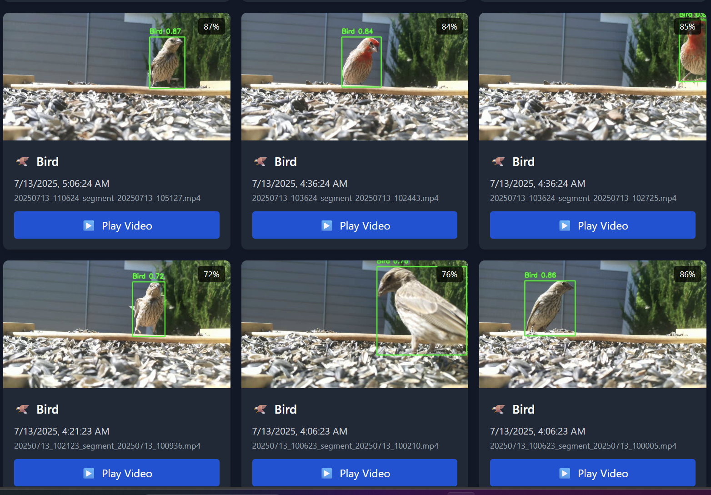
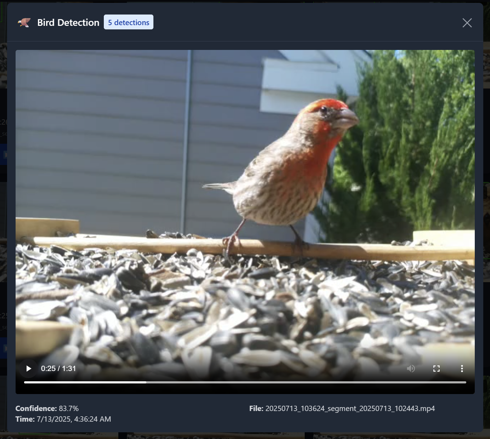

# BirdCam - Distributed Wildlife Detection System

A two-system architecture for wildlife detection: Raspberry Pi cameras capture video, and a separate AI server processes it.




## 🏗️ System Architecture

BirdCam uses a **two-system design** for flexibility and performance:

```
┌─────────────────────┐                    ┌─────────────────────┐
│   RASPBERRY PI      │                    │   AI PROCESSING     │
│                     │                    │      SERVER         │
│  • Camera capture   │     Network        │  • YOLO detection   │
│  • Motion detection │ ◄────────────────► │  • Video storage    │
│  • Video streaming  │    Sync videos     │  • Web interface    │
│  • Basic web API    │                    │  • User management  │
└─────────────────────┘                    └─────────────────────┘
         ▲                                           ▲
         │                                           │
         └─────────────────┬─────────────────────────┘
                           │
                    ┌──────▼──────┐
                    │ WEB BROWSER │
                    │             │
                    │ • Live view │
                    │ • Settings  │
                    └─────────────┘
```

### System 1: Raspberry Pi (Camera Capture)
- **Purpose**: Capture video from cameras
- **Runs**: `pi_capture/main.py`
- **Features**: Motion detection, multi-camera support, video buffering
- **Config**: Uses `.env.pi` (renamed from `.env`)

### System 2: AI Processing Server (Any Linux/Windows/Mac)
- **Purpose**: Process videos with AI, serve web interface
- **Runs**: `ai_processor/main.py`
- **Features**: YOLO detection, video storage, web UI, user management
- **Config**: Uses `.env.processor` (renamed from `.env`)

## 🚀 Quick Start Guide

### Step 1: Choose Your Setup

You need TWO separate machines:
1. **Raspberry Pi** with camera(s) attached
2. **Processing Server** (can be any computer with decent CPU/GPU)

### Step 2: Set Up the Raspberry Pi

```bash
# 1. Clone the repository
git clone https://github.com/yourusername/birdcam.git
cd birdcam

# 2. Create Pi-specific configuration
cp .env.pi.example .env.pi
nano .env.pi

# 3. Edit these key settings:
PROCESSING_SERVER=192.168.1.100  # IP of your AI server
CAMERA_IDS=0                     # Your camera ID(s)

# 4. Install dependencies
pip install -r requirements.pi.txt

# 5. Setup camera permissions
./setup_pi_camera.sh

# 6. Start capture service
python pi_capture/main.py
```

### Step 3: Set Up the AI Processing Server

```bash
# 1. Clone the repository (on your processing server)
git clone https://github.com/yourusername/birdcam.git
cd birdcam

# 2. Create processor-specific configuration
cp .env.processor.example .env.processor
nano .env.processor

# 3. Edit settings (most defaults are fine)

# 4. Install dependencies
pip install -r requirements.processor.txt

# 5. Start AI processor
python ai_processor/main.py

# 6. Set up web UI
cd web-ui
cp .env.example .env
nano .env  # Update with your server IPs
npm install
npm run build
```

### Step 4: Initial Admin Setup

1. Open web browser to: `http://YOUR_PROCESSOR_IP:8091`
2. You'll be redirected to `/setup` automatically
3. Create your admin account (must be on local network)
4. Start using the system!

## 📋 Configuration Files Explained

### On Raspberry Pi
- **`.env.pi`** - Pi-specific settings (camera, motion, sync)
- **Key settings**:
  ```bash
  PROCESSING_SERVER=192.168.1.100  # CRITICAL: Your AI server IP
  CAMERA_IDS=0,1                   # Camera IDs to use
  MOTION_THRESHOLD=5000            # Motion sensitivity
  ```

### On Processing Server  
- **`.env.processor`** - AI server settings (detection, storage)
- **`web-ui/.env`** - Frontend URLs
- **Key settings**:
  ```bash
  # In web-ui/.env:
  VITE_PI_SERVER=http://192.168.1.50:8090        # Pi's IP
  VITE_PROCESSING_SERVER=http://192.168.1.100:8091 # This server's IP
  ```

## 🎥 Multi-Camera Support

- **Camera 0**: Active camera (performs motion detection)
- **Camera 1+**: Passive cameras (record when Camera 0 detects motion)
- All cameras record synchronized video from different angles

## 🔧 Detailed Setup Guides

- [Raspberry Pi Setup Guide](docs/PI_SETUP.md)
- [Processing Server Setup Guide](docs/PROCESSOR_SETUP.md)
- [Configuration Reference](docs/CONFIGURATION.md)
- [Troubleshooting Guide](docs/TROUBLESHOOTING.md)

## 📊 Features

- **Real-time Monitoring**: Live camera feeds from all cameras
- **AI Detection**: Identifies birds, cats, dogs, and more
- **Smart Storage**: Keeps detections for 30 days, others for 7
- **Web Interface**: Modern React UI with dark mode
- **User Management**: Admin and viewer accounts
- **Motion Zones**: Configure detection regions per camera

## 🛠️ Development

```bash
# Run tests
pytest

# Development mode
cd web-ui && npm run dev

# Build for production
cd web-ui && npm run build
```

## 📝 License

MIT License - see LICENSE file

## 🤝 Contributing

1. Fork the repository
2. Create a feature branch
3. Submit a pull request

## ❓ Support

- Check [Troubleshooting Guide](docs/TROUBLESHOOTING.md)
- Open an issue on GitHub
- Include logs and configuration details